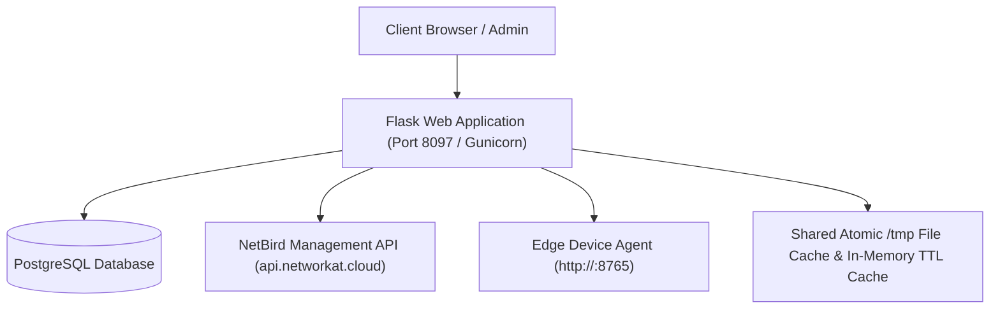
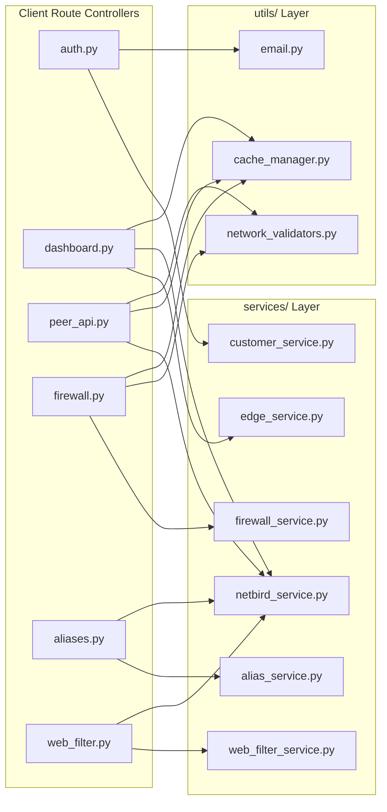

# Networkat SD-WAN Web Application — Comprehensive Project Architecture & Codebase Guide

> **Location:** `/opt/networkat_sdwan/core/web_app`  
> **Repository:** `omar3yad/sdwan`  
> **Platform:** Networkat SD-WAN Cloud Management Platform & Customer Portal  
> **Architecture Standard:** Clean Architecture & Modular Blueprint Design (Zero Breaking Changes)

---

## 1. Executive Overview & System Purpose

The **Networkat SD-WAN Core Web App** is a centralized multi-tenant management portal and API gateway designed for orchestrating software-defined networking (SD-WAN) edge devices. It enables:
1. **Multi-Tenant Customer Portal (`/client`)**: End-user portal for monitoring connected edge peers, configuring inline network routes, managing L4/L7 stateful firewall rules, DNS forwarding/aliases, and AdGuard web content filters.
2. **Administrative Control Center (`/admin`)**: High-level platform administration for customer account provisioning, edge assignment, policy enforcement, and audit logs.
3. **NetBird Mesh VPN Orchestration**: Interfacing with NetBird's WireGuard mesh network (`api.networkat.cloud`) to automatically manage network groups, setup keys, routes, and real-time telemetry.
4. **Edge Device Control Plane**: Directly interacting with edge agents running on Linux/OpenWrt edge devices over port `:8765` for applying dynamic firewall rules, DNS filtering, and domain blocking.

---

## 2. Technology Stack & Runtime Architecture

- **Backend Frameworks**: Python 3.11+, Flask (Modular Blueprints for `client` and `admin`), FastAPI (`fastapi_app` for internal microservice APIs).
- **Database & ORM**: PostgreSQL, SQLAlchemy, Flask-Migrate (Alembic).
- **Concurrency & Caching**: Python `ThreadPoolExecutor`, atomic `/tmp/` file-based JSON caching with timestamps, threading `Lock`s for thread-safe state synchronization.
- **Process Management**: `supervisord`, `gunicorn`, `entrypoint.sh` for auto-waiting PostgreSQL readiness and running database migrations.
- **Frontend Layer**: Clean Vanilla JavaScript (ES6+), Semantic HTML5, CSS Variables (`--nk-*` design system), Jinja2 templating, and global Mathematical IPv4 Subnet Normalization (`parseAndValidateIPv4`).



---

## 3. High-Level Directory Structure

```text
/opt/networkat_sdwan/core/web_app/
├── admin/                       # Admin management portal blueprint & routes
├── client/                      # Customer-facing Clean Architecture portal
│   ├── __init__.py              # Client package entry point
│   ├── blueprint.py             # Flask Blueprint definition & context processor registration
│   ├── decorators.py            # Route security & cache decorators
│   ├── context_processors.py    # Dynamic sidebar peer data injection
│   ├── routes/                  # Modular domain route controllers
│   │   ├── __init__.py          # Routes aggregate module
│   │   ├── auth.py              # Authentication, registration & setup key API
│   │   ├── dashboard.py         # Dashboard, fleet overview & peer details
│   │   ├── peer_api.py          # NetBird peer status, routes & VPN-only proxy
│   │   ├── firewall.py          # L4/L7 stateful firewall management & agent proxy
│   │   ├── aliases.py           # Address lists (Aliases) & DNS forwarding
│   │   └── web_filter.py        # Web content filter & AdGuard services
│   ├── static/                  # Dedicated CSS & JS assets
│   │   ├── css/                 # Extracted modular stylesheet files
│   │   └── js/                  # Extracted modular client logic scripts
│   └── templates/               # Streamlined Jinja2 HTML templates
├── config/                      # Flask & database configuration
├── database/                    # Database session & migration scripts
├── fastapi_app/                 # Internal FastAPI microservice router
├── middleware/                  # Request middleware & telemetry interceptors
├── migrations/                  # Alembic DB migration files
├── models/                      # SQLAlchemy ORM models
├── repositories/                # Data Access Object (DAO) repositories
├── services/                    # Business logic & external API integration services
├── tests/                       # Automated test suites
└── utils/                       # Shared validators, email & cache helpers
```

---

## 4. Client Core Foundation (`client/`)

### 4.1 [client/__init__.py](file:///opt/networkat_sdwan/core/web_app/client/__init__.py)
* **Responsibility & Role:** Package entry point. Imports and exports `client_bp` from `client.routes` to ensure zero breaking changes for existing application initialization scripts (such as `client_app.py`).
* **Exports:** `client_bp`.

### 4.2 [client/blueprint.py](file:///opt/networkat_sdwan/core/web_app/client/blueprint.py)
* **Responsibility & Role:** Declares the main Flask `Blueprint('client', __name__, template_folder='templates', static_folder='static')` and binds global blueprint-level hooks, specifically attaching `inject_client_sidebar` as a context processor.
* **Key Components:**
  * `client_bp`: The central blueprint instance.
  * `@client_bp.context_processor(inject_client_sidebar)`: Automatically registers sidebar peer data injection for all rendered client templates.

### 4.3 [client/decorators.py](file:///opt/networkat_sdwan/core/web_app/client/decorators.py)
* **Responsibility & Role:** Provides reusable, cross-cutting security, authorization, and caching decorators for customer routes.
* **Functions & Decorators:**
  * `@login_required`: Validates that `session.get('client_logged_in')` is `True`. If not authenticated, redirects the user to `client.login`.
  * `no_cache_json(payload, status_code=200)`: Returns a JSON `Response` with explicit HTTP headers (`Cache-Control: no-cache, no-store, must-revalidate`, `Pragma: no-cache`, `Expires: 0`) to prevent intermediate proxies and browsers from caching sensitive telemetry.
  * `verify_peer_access(customer, peer_id: str) -> bool`: Verifies that a given `peer_id` belongs to the authenticated `customer` by checking the customer's cached NetBird group membership (`NetBirdService.verify_peer_access`).

### 4.4 [client/context_processors.py](file:///opt/networkat_sdwan/core/web_app/client/context_processors.py)
* **Responsibility & Role:** Global context injector for Jinja2 templates.
* **Functions:**
  * `inject_client_sidebar()`:
    * Executed before rendering any template in `client_bp`.
    * Checks `session.get('client_customer_id')`.
    * Queries `Client` and gets allowed peer IDs via `NetBirdService.get_cached_customer_peer_ids`.
    * Uses a `ThreadPoolExecutor(max_workers=20)` to concurrently check WireGuard handshake reachability for each peer (`NetBirdService.check_single_peer_handshake`).
    * Returns a dictionary `{'sidebar_peers': [{'id', 'name', 'connected', 'ip'}, ...]}` injected directly into template context.

---

## 5. Client Route Controllers (`client/routes/`) — Complete Endpoints Reference

### 5.1 [client/routes/__init__.py](file:///opt/networkat_sdwan/core/web_app/client/routes/__init__.py)
* **Responsibility & Role:** Aggregates all route modules (`auth`, `dashboard`, `peer_api`, `firewall`, `aliases`, `web_filter`) and registers their endpoints onto `client_bp`.

---

### 5.2 [client/routes/auth.py](file:///opt/networkat_sdwan/core/web_app/client/routes/auth.py) — Authentication & Setup Keys

#### 1. Setup Key REST API
* **Route Path:** `POST /api/v1/auth/setup-key`
* **Internal Endpoint Name:** `client.api_get_setup_key`
* **Decorators / Security:** In-memory Rate Limiting (5 requests per 60 seconds per IP via `_check_rate_limit`).
* **Expected Input:**
  * Headers: `Content-Type: application/json`
  * Body: `{"username": "string", "password": "string"}`
* **Expected Output:**
  * Success (200 OK): `{"setup_key": "string", "username": "string"}`
  * Bad Request (400): `{"error": "Bad Request", "message": "..."}`
  * Unauthorized (401): `{"error": "Unauthorized", "message": "Invalid credentials or account is not active."}`
  * Not Found (404): `{"error": "Not Found", "message": "No active setup key found..."}`
  * Media Type (415): `{"error": "Unsupported Media Type", "message": "..."}`
  * Rate Limited (429): `{"error": "Too Many Requests", "message": "..."}`
  * Server Error (500): `{"error": "Internal Server Error", "message": "..."}`
* **Service Integrations:** `CustomerService.authenticate_client_user`, `TokenRepository.get_by_client`.

#### 2. Customer Login
* **Route Path:** `GET, POST /login`
* **Internal Endpoint Name:** `client.login`
* **Decorators:** None.
* **Input:** Form Data: `username`, `password`.
* **Output:**
  * `GET`: Renders `login.html`.
  * `POST (Success)`: Sets `session['client_logged_in']`, `session['client_customer_id']`, redirects to `client.dashboard`.
  * `POST (Failure)`: Flashes error, re-renders `login.html`.
* **Service Integrations:** `CustomerService.authenticate_client_user`.

#### 3. Customer Logout
* **Route Path:** `GET /logout`
* **Internal Endpoint Name:** `client.logout`
* **Decorators:** None.
* **Output:** Clears `session`, redirects to `client.login`.

#### 4. Customer Registration
* **Route Path:** `GET, POST /register`
* **Internal Endpoint Name:** `client.register`
* **Decorators:** Google reCAPTCHA v3 verification (if configured).
* **Input:** Form Data: `username`, `password`, `confirm_password`, `client_name`, `client_company_name`, `client_email`, `client_phone_number`, `client_country`, `subscription`, `g-recaptcha-response`.
* **Output:**
  * `GET`: Renders `register.html`.
  * `POST (Success)`: Stores temporary registration state in `session['reg_data']`, generates 6-digit code in `session['reg_verification']`, sends verification email, redirects to `client.verify_email`.
* **Service Integrations:** `send_verification_email` (`utils/email.py`), `CustomerService.client_repo`.

#### 5. Verify Email
* **Route Path:** `GET, POST /verify-email`
* **Internal Endpoint Name:** `client.verify_email`
* **Input:** Form Data: `code` (6-digit OTP).
* **Output:**
  * `GET`: Renders `verify_email.html` with masked email.
  * `POST (Success)`: Calls `CustomerService.create_customer(reg_data)`, creates DB records and NetBird group, redirects to `client.login`.
* **Service Integrations:** `CustomerService.create_customer`.

#### 6. Resend Email Verification Code
* **Route Path:** `GET, POST /resend-code`
* **Internal Endpoint Name:** `client.resend_code`
* **Output:** Generates new 6-digit code, updates `session['reg_verification']`, sends email, redirects to `client.verify_email`.

#### 7. Forgot Password
* **Route Path:** `GET, POST /forgot-password`
* **Internal Endpoint Name:** `client.forgot_password`
* **Input:** Form Data: `identifier` (email or username).
* **Output:**
  * `GET`: Renders `forgot_password.html`.
  * `POST (Success)`: Generates reset code in `session['reset_password_data']`, sends reset email, redirects to `client.reset_password`.
* **Service Integrations:** `send_password_reset_email` (`utils/email.py`), `CustomerService.client_repo`.

#### 8. Reset Password
* **Route Path:** `GET, POST /reset-password`
* **Internal Endpoint Name:** `client.reset_password`
* **Input:** Form Data: `code`, `new_password`, `confirm_password`.
* **Output:** Updates password hash in DB, redirects to `client.login`.

#### 9. Resend Reset Code
* **Route Path:** `GET, POST /resend-reset-code`
* **Internal Endpoint Name:** `client.resend_reset_code`
* **Output:** Sends fresh reset OTP, redirects to `client.reset_password`.

---

### 5.3 [client/routes/dashboard.py](file:///opt/networkat_sdwan/core/web_app/client/routes/dashboard.py) — Fleet & Device Management

#### 1. Main Dashboard
* **Route Path:** `GET /`
* **Internal Endpoint Name:** `client.dashboard`
* **Decorators:** `@login_required`.
* **Output:** Renders `dashboard.html` with `customer_name`, `total_edges`, `online_edges`, `offline_edges`.
* **Service Integrations:** `EdgeService.edge_repo.count_by_customer`.

#### 2. Peer Devices Fleet Page
* **Route Path:** `GET /peers`
* **Internal Endpoint Name:** `client.peers_page`
* **Decorators:** `@login_required`.
* **Output:** Renders `peers.html`.

#### 3. Peer Details Telemetry View
* **Route Path:** `GET /peers/<peer_id>`
* **Internal Endpoint Name:** `client.peer_details`
* **Decorators:** `@login_required`, `verify_peer_access`.
* **URL Params / Query:** `peer_id` (string), optional `name` in query string.
* **Output:** Renders `peer_details.html` with:
  * `peer_id`, `peer_name`, `customer_name`, `is_online`, `peer_ip`, `peer_public_ip`, `peer_os`, `peer_version`, `peer_last_seen`, `peer_network`, `peer_route_id`, `peer_route_network_id`.
* **Service Integrations:** `NetBirdService.get_cached_all_netbird_peers`, `NetBirdService.check_single_peer_handshake`, `NetBirdService.get_cached_all_netbird_routes`, `get_active_route_overrides`.

#### 4. Update Peer Name
* **Route Path:** `POST /peers/<peer_id>/update`
* **Internal Endpoint Name:** `client.update_peer`
* **Decorators:** `@login_required`.
* **Input:** JSON: `{"name": "New Device Name"}`.
* **Output (JSON):**
  * Success (200): `{"success": true, "message": "Saved successfully"}`
  * Validation Error (400): `{"success": false, "error": "Name already in use" | "Name required"}`
  * Unauthorized (403): `{"success": false, "error": "Unauthorized"}`
* **Service Integrations:** `EdgeService.update_peer_name`, `set_name_override`, `clear_all_netbird_caches`.

#### 5. Get Customer Setup Keys API
* **Route Path:** `GET /api/customer/setup-keys`
* **Internal Endpoint Name:** `client.get_customer_setup_keys`
* **Decorators:** `@login_required`.
* **Output (JSON):** `{"tokens": [{"token": "...", "is_active": bool, "used_times": int, "usage_limit": int, "remaining_uses": int, "created_at": "..."}]}`.
* **Service Integrations:** `Token.query.filter_by(client_id=...)`, NetBird `/api/v2/netbird/setup-keys`.

---

### 5.4 [client/routes/peer_api.py](file:///opt/networkat_sdwan/core/web_app/client/routes/peer_api.py) — Telemetry, NetBird Routes & VPN-Only Mode

#### 1. Proxy Customer Peers List
* **Route Path:** `GET /api/peers`
* **Internal Endpoint Name:** `client.proxy_peers`
* **Decorators:** `@login_required`.
* **Query Params:** `name` (optional filter).
* **Output (JSON):** `[{"id": "...", "name": "...", "connected": bool, "last_seen": "...", "ip": "..."}]`.
* **Service Integrations:** `NetBirdService.get_cached_all_netbird_peers`, `get_name_override`.

#### 2. Peer Handshake Check
* **Route Path:** `GET /api/peers/<peer_id>/handshake`
* **Internal Endpoint Name:** `client.peer_handshake`
* **Decorators:** `@login_required`.
* **Output (JSON):** Returns NetBird handshake status payload `{"peer_id": "...", "is_reachable": bool, "last_handshake": "..."}`.
* **Service Integrations:** NetBird `/api/v1/peers/{peer_id}/handshake`.

#### 3. Proxy Get NetBird Routes
* **Route Path:** `GET /api/v2/netbird/routes`
* **Internal Endpoint Name:** `client.proxy_get_routes`
* **Decorators:** `@login_required`.
* **Output (JSON):** Returns active NetBird routes merged with local route overrides (`get_active_route_overrides`).

#### 4. Proxy Create NetBird Route
* **Route Path:** `POST /api/v2/netbird/routes`
* **Internal Endpoint Name:** `client.proxy_post_route`
* **Decorators:** `@login_required`.
* **Input (JSON):** `{"peer": "peer_id", "network": "192.168.10.2/24", "network_id": "..."}`.
* **Processing:** Validates and normalizes subnet via `validate_route_network` (`192.168.10.2/24` $\rightarrow$ `192.168.10.0/24`). Enforces customer NetBird group isolation.
* **Output (JSON):** NetBird created route object (Status 200/201).
* **Service Integrations:** `validate_route_network`, `set_route_override`, `clear_all_netbird_caches`.

#### 5. Proxy Update NetBird Route
* **Route Path:** `PUT /api/v2/netbird/routes/<route_id>`
* **Internal Endpoint Name:** `client.proxy_put_route`
* **Decorators:** `@login_required`.
* **Input (JSON):** `{"peer": "peer_id", "network": "10.50.25.65/26", ...}`.
* **Processing:** Bitwise normalizes subnet to `10.50.25.64/26`. Updates NetBird route.
* **Output (JSON):** NetBird updated route object (Status 200/204).

#### 6. Proxy Delete NetBird Route
* **Route Path:** `DELETE /api/v2/netbird/routes/<route_id>`
* **Internal Endpoint Name:** `client.proxy_delete_route`
* **Decorators:** `@login_required`.
* **Output:** Status 200/204 on successful removal; clears local route override.

#### 7. Real-Time Peer Status SSE/Polling API
* **Route Path:** `GET /api/peers/status`
* **Internal Endpoint Name:** `client.get_peers_status_api`
* **Decorators:** `@login_required`, `no_cache_json`.
* **Caching Mechanics:**
  1. *Fresh Cache (< 30s):* Returns immediately.
  2. *Stale Cache:* Returns stale data instantly while triggering background asynchronous revalidation (`_revalidate_customer_peers_status`) via `ThreadPoolExecutor`.
  3. *No Cache:* Executes synchronous concurrent handshake polling.
* **Output (JSON):**
  ```json
  {
    "peers": [{"id": "...", "name": "...", "is_online": true, "ip": "..."}],
    "summary": {"total": 5, "online": 4, "offline": 1}
  }
  ```

#### 8. VPN-Only Mode Proxy
* **Route Path:** `GET, POST /api/peers/<peer_id>/vpn-only`
* **Internal Endpoint Name:** `client.peer_vpn_only_proxy`
* **Decorators:** `@login_required`.
* **Input (POST JSON):** `{"action": "enable" | "disable"}` (or `{"operation": "enable" | "disable"}`).
* **Target:** Communicates directly with edge agent at `http://<peer_ip>:8765/vpn-only`.
* **Output (JSON):** `{"status": "success", "enabled": bool}`.
* **Service Integrations:** `vpn_only_cache`, `clear_all_netbird_caches`.

---

### 5.5 [client/routes/firewall.py](file:///opt/networkat_sdwan/core/web_app/client/routes/firewall.py) — Stateful L4/L7 Firewall Rules

#### 1. Firewall Page View
* **Route Path:** `GET /peers/<peer_id>/firewall`
* **Internal Endpoint Name:** `client.peer_firewall`
* **Decorators:** `@login_required`, `verify_peer_access`.
* **Output:** Renders `firewall.html` with `peer_id`, `peer_name`, `customer_name`, `is_online`, `vpn_only`.

#### 2. Get Live Firewall Rules
* **Route Path:** `GET /api/peers/<peer_id>/firewall/rules`
* **Internal Endpoint Name:** `client.get_peer_firewall_rules`
* **Decorators:** `@login_required`.
* **Query Params:** `refresh=true` (forces bypass of 15s cache).
* **Target:** Edge Agent at `http://<peer_ip>:8765/firewall/rules`.
* **Output (JSON):**
  ```json
  {
    "rules": [
      {
        "id": 1,
        "rule_name": "Sales Web",
        "src_ip": "192.168.1.0/24",
        "dst_ip": "@sales_servers",
        "src_port": "",
        "dst_port": "80,443",
        "protocol": "tcp",
        "action": "ALLOW",
        "interface": "lan",
        "enabled": true,
        "order": 1,
        "packets": 1420,
        "bytes": 859200
      }
    ],
    "agent_online": true
  }
  ```

#### 3. Add Firewall Rule
* **Route Path:** `POST /api/peers/<peer_id>/firewall/rules`
* **Internal Endpoint Name:** `client.add_peer_firewall_rule`
* **Decorators:** `@login_required`.
* **Input (JSON):**
  * `rule_name`: string (optional, auto-generates `rule_XXXXXX` if omitted)
  * `action`: `"allow"` | `"drop"`
  * `protocol`: `"tcp"` | `"udp"` | `"tcp+udp"` | `"icmp"` | `"any"`
  * `interface`: `"lan"` | `"vpn"`
  * `src_ip`: comma-separated CIDRs or single `@alias_name`
  * `dst_ip`: comma-separated CIDRs or single `@alias_name`
  * `src_port`: comma-separated ports or port-ranges (e.g. `"80,443,8000-8080"`)
  * `dst_port`: comma-separated ports or port-ranges
  * `order`: integer (optional)
* **Validation:** Python validators `validate_address_spec`, `validate_port_spec`.
* **Target:** Edge Agent `POST http://<peer_ip>:8765/firewall/rules`.
* **Output (JSON):** `{"success": true, "rule_id": 999}` (Status 201).

#### 4. Toggle Firewall Rule
* **Route Path:** `POST /api/peers/<peer_id>/firewall/rules/<int:rule_id>/toggle`
* **Internal Endpoint Name:** `client.toggle_peer_firewall_rule`
* **Target:** Edge Agent `POST http://<peer_ip>:8765/firewall/rules/enable` or `/disable`.
* **Output (JSON):** `{"success": true, "enabled": bool}` (Status 200).

#### 5. Edit Firewall Rule
* **Route Path:** `PUT /api/peers/<peer_id>/firewall/rules/<int:rule_id>`
* **Internal Endpoint Name:** `client.edit_peer_firewall_rule`
* **Input (JSON):** Full rule specification.
* **Target:** Edge Agent `PUT http://<peer_ip>:8765/firewall/rules/<slug>`.
* **Output (JSON):** `{"success": true}` (Status 200).

#### 6. Delete Firewall Rule
* **Route Path:** `DELETE /api/peers/<peer_id>/firewall/rules/<int:rule_id>`
* **Internal Endpoint Name:** `client.delete_peer_firewall_rule`
* **Target:** Edge Agent `POST http://<peer_ip>:8765/firewall/rules/remove` with `{"ids": [slug]}`.
* **Output (JSON):** `{"success": true}` (Status 200).

#### 7. Bulk Actions on Rules
* **Route Path:** `POST /api/peers/<peer_id>/firewall/rules/bulk`
* **Internal Endpoint Name:** `client.bulk_peer_firewall_rules`
* **Input (JSON):** `{"action": "enable" | "disable" | "delete", "rule_ids": [1, 2, 5]}`.
* **Output (JSON):** `{"success": true}` (Status 200).

#### 8. Reorder Firewall Rules (Drag & Drop)
* **Route Path:** `POST /api/peers/<peer_id>/firewall/rules/reorder`
* **Internal Endpoint Name:** `client.reorder_peer_firewall_rules`
* **Input (JSON):** `{"items": [{"id": 1, "order": 1}, {"id": 2, "order": 2}]}`.
* **Target:** Edge Agent `POST http://<peer_ip>:8765/firewall/rules/reorder`.
* **Output (JSON):** Edge Agent reorder response (Status 200).

#### 9. Sync Firewall Rules
* **Route Path:** `POST /api/peers/<peer_id>/firewall/rules/sync`
* **Internal Endpoint Name:** `client.sync_peer_firewall_rules`
* **Target:** Edge Agent `POST http://<peer_ip>:8765/firewall/rules/sync`.
* **Output (JSON):** Edge Agent sync confirmation (Status 200).

#### 10. Reset Rule Traffic Counters
* **Route Path:** `POST /api/peers/<peer_id>/firewall/rules/<int:rule_id>/reset-counter`
* **Internal Endpoint Name:** `client.reset_peer_firewall_rule_counter`
* **Target:** Edge Agent `POST http://<peer_ip>:8765/firewall/rules/reset-counter`.
* **Output (JSON):** Status 200 OK.

---

### 5.6 [client/routes/aliases.py](file:///opt/networkat_sdwan/core/web_app/client/routes/aliases.py) — Address Lists (Aliases) & DNS Forwarding

#### 1. Aliases Navigation Router
* **Route Path:** `GET /peers/aliases`
* **Internal Endpoint Name:** `client.aliases_page`
* **Decorators:** `@login_required`.
* **Query Params:** `peer_id` (optional), `filter` (optional: `normal` | `web_domain`).
* **Behavior:** Automatically detects customer peers, selects the first online peer, and redirects cleanly to `client.peer_aliases`.

#### 2. Peer Aliases Page View
* **Route Path:** `GET /peers/<peer_id>/aliases`
* **Internal Endpoint Name:** `client.peer_aliases`
* **Decorators:** `@login_required`, `verify_peer_access`.
* **Output:** Renders `aliases.html` with `customer_name`, `peers`, `selected_peer_id`, `peer_name`, `is_online`.

#### 3. Proxy Get Address Lists
* **Route Path:** `GET /api/peers/<peer_id>/aliases`
* **Internal Endpoint Name:** `client.get_peer_address_lists_proxy`
* **Target:** Edge Agent `GET http://<peer_ip>:8765/aliases`.
* **Output (JSON):** Array of alias objects with name, type (`normal` or `web_domain`), comment, and items.

#### 4. Proxy Add Address List
* **Route Path:** `POST /api/peers/<peer_id>/aliases`
* **Internal Endpoint Name:** `client.add_peer_address_list_proxy`
* **Target:** Edge Agent `POST http://<peer_ip>:8765/aliases`.
* **Input (JSON):** `{"name": "sales_servers", "type": "normal", "comment": "...", "items": ["192.168.1.10", "192.168.1.20"]}`.

#### 5. Proxy Modify / Delete Address List
* **Route Path:** `PUT, PATCH, DELETE /api/peers/<peer_id>/aliases/<slug>`
* **Internal Endpoint Name:** `client.modify_peer_address_list_proxy`
* **Target:** Edge Agent `http://<peer_ip>:8765/aliases/<slug>`.

#### 6. Proxy Sync Address Lists
* **Route Path:** `POST /api/peers/<peer_id>/aliases/sync`
* **Internal Endpoint Name:** `client.sync_peer_address_lists_proxy`
* **Target:** Edge Agent `POST http://<peer_ip>:8765/aliases/sync`.

#### 7. Proxy Get DNS Forwarding / Resolver Config
* **Route Path:** `GET /api/peers/<peer_id>/resolver-config`
* **Internal Endpoint Name:** `client.get_peer_resolver_config_proxy`
* **Target:** NetBird/FastAPI `/api/v1/peers/{peer_id}/adguard/dns_info`.

#### 8. Proxy Update DNS Forwarding / Resolver Config
* **Route Path:** `PUT /api/peers/<peer_id>/resolver-config`
* **Internal Endpoint Name:** `client.update_peer_resolver_config_proxy`
* **Target Integration:**
  1. Updates upstream DNS rules in AdGuard via `/api/v1/peers/{peer_id}/adguard/dns_config`.
  2. Parses forwarding items matching `[/domain/]ip` and synchronizes them directly to the Edge Agent's `PUT http://<peer_ip>:8765/dns-forwarding` endpoint.

---

### 5.7 [client/routes/web_filter.py](file:///opt/networkat_sdwan/core/web_app/client/routes/web_filter.py) — Web Filter & AdGuard Services

#### 1. Web Filter Page View
* **Route Path:** `GET /peers/<peer_id>/web-filter`
* **Internal Endpoint Name:** `client.peer_web_filter`
* **Decorators:** `@login_required`, `verify_peer_access`.
* **Output:** Renders `web_filter.html` with `peer_id`, `peer_name`, `customer_name`, `is_online`, `vpn_only`.

#### 2. Legacy Filtering Page View
* **Route Path:** `GET /peers/<peer_id>/filtering`
* **Internal Endpoint Name:** `client.peer_filtering`
* **Decorators:** `@login_required`, `verify_peer_access`.
* **Output:** Renders `filtering.html`.

#### 3. Proxy Get / Update Blocked Services (AdGuard)
* **Route Paths:**
  * `GET, POST, PUT /api/peers/<peer_id>/adguard/blocked_services` (`client.get_peer_blocked_services`, `client.update_peer_blocked_services`)
  * `GET, POST, PUT /api/peers/<peer_id>/adguard/clients/<client_name>/blocked_services` (`client.get_client_blocked_services_proxy`, `client.update_client_blocked_services_proxy`)
* **Target:** NetBird/FastAPI `/api/v1/peers/{peer_id}/adguard/...`.

#### 4. Proxy Web Filter Rules CRUD
* **Route Paths:**
  * `GET, POST /api/peers/<peer_id>/web-filter/rules` (`client.get_peer_web_filter_rules`, `client.add_peer_web_filter_rule`)
  * `PUT, DELETE /api/peers/<peer_id>/web-filter/rules/<rule_id>` (`client.update_peer_web_filter_rule`, `client.delete_peer_web_filter_rule`)
  * `POST /api/peers/<peer_id>/web-filter/rules/remove` (`client.bulk_remove_peer_web_filter_rules`)
  * `POST /api/peers/<peer_id>/web-filter/rules/enable` (`client.enable_peer_web_filter_rules`)
  * `POST /api/peers/<peer_id>/web-filter/rules/disable` (`client.disable_peer_web_filter_rules`)
* **Target:** Edge Agent `http://<peer_ip>:8765/web-filter/rules/...`.

---

## 6. Client Presentation Layer — Templates Reference (`client/templates/`)

All templates are streamlined and extend `client_base.html`:

| Template File | Purpose & Function | Injected Context Parameters |
| :--- | :--- | :--- |
| **`client_base.html`** | Base layout containing responsive navigation sidebar, dynamic online peer listing, user profile dropdown, unified toast system, and `network_math.js`. | `customer_name`, `sidebar_peers` (from context processor). |
| **`dashboard.html`** | Overview metrics cards (Total, Online, Offline edges), quick peer installation curl command, and customer setup keys table. | `customer_name`, `total_edges`, `online_edges`, `offline_edges`. |
| **`peers.html`** | Full peer fleet table with real-time status polling, editable network CIDRs, and VPN-only toggle switch. | `customer_name`, `netbird_peers`. |
| **`peer_details.html`** | Detailed telemetry card for a single peer (IP, public connection IP, OS, version, last handshake, uptime, and inline route editor). | `peer_id`, `peer_name`, `customer_name`, `is_online`, `peer_ip`, `peer_public_ip`, `peer_os`, `peer_version`, `peer_last_seen`, `peer_network`, `peer_route_id`, `peer_route_network_id`. |
| **`firewall.html`** | Stateful firewall builder, reorderable table, packet/byte counters, address/port multi-row modal, and DNS resolver configuration. | `peer_id`, `peer_name`, `customer_name`, `is_online`, `vpn_only`. |
| **`aliases.html`** | Network Aliases manager for grouping IP addresses, subnets, and hostnames with live first-character detection (`0-9` vs `a-zA-Z`), and DNS Forwarding settings. | `customer_name`, `peers`, `selected_peer_id`, `peer_id`, `peer_name`, `is_online`. |
| **`web_filter.html`** | L7 Web content filter managing domain-blocking rules, category filtering, and embedded aliases. | `peer_id`, `peer_name`, `customer_name`, `is_online`, `vpn_only`. |
| **`filtering.html`** | AdGuard DNS content filtering and service blocking toggles with floating save/discard bar. | `peer_id`, `peer_name`, `customer_name`, `is_online`. |
| **`login.html`** | Customer authentication form. | Flash messages. |
| **`register.html`** | Customer self-service registration form with reCAPTCHA v3. | `recaptcha_site_key`. |
| **`verify_email.html`** | 6-digit OTP verification screen for email confirmation. | `email`. |
| **`forgot_password.html`**| Self-service password reset request form. | Flash messages. |
| **`reset_password.html`** | 6-digit OTP code verification and new password entry screen. | `email`. |

---

## 7. Client Static Assets Reference (`client/static/`)

### 7.1 Modular CSS Files (`client/static/css/`)
* **[base.css](file:///opt/networkat_sdwan/core/web_app/client/static/css/base.css)**: Central design system tokens (`--nk-primary`, `--nk-bg-main`, `--nk-radius-sm`), sidebar layout, topbar header, modal backdrop, buttons, and animations.
* **[dashboard.css](file:///opt/networkat_sdwan/core/web_app/client/static/css/dashboard.css)**: Stat cards grid, quick installation command box, and setup keys table styles.
* **[peers.css](file:///opt/networkat_sdwan/core/web_app/client/static/css/peers.css)**: Peer fleet table, status badges, and inline network route inputs.
* **[peer_details.css](file:///opt/networkat_sdwan/core/web_app/client/static/css/peer_details.css)**: Telemetry grid, system metrics cards, and graph placeholders.
* **[firewall.css](file:///opt/networkat_sdwan/core/web_app/client/static/css/firewall.css)**: Firewall rules table, drag handles, protocol/action badges, counter labels, and floating bulk action bar.
* **[aliases.css](file:///opt/networkat_sdwan/core/web_app/client/static/css/aliases.css)**: Alias cards, sticky item headers, character counters, and DNS Forwarding modal.
* **[web_filter.css](file:///opt/networkat_sdwan/core/web_app/client/static/css/web_filter.css)**: Domain tag chips, category selection grid, and domain blocking rule modal.
* **[filtering.css](file:///opt/networkat_sdwan/core/web_app/client/static/css/filtering.css)**: Filtering toggle cards and floating unsaved changes bar.
* **[styles.css](file:///opt/networkat_sdwan/core/web_app/client/static/styles.css)**: Authentication screen layouts (`login`, `register`, `forgot_password`).

### 7.2 Modular JS Files (`client/static/js/`)
* **[network_math.js](file:///opt/networkat_sdwan/core/web_app/client/static/js/network_math.js)**: Global mathematical subnet normalization engine (`window.parseAndValidateIPv4`). Implements unsigned 32-bit bitwise math to sanitize host addresses inside subnets and return clean network CIDRs.
* **[toast.js](file:///opt/networkat_sdwan/core/web_app/client/static/js/toast.js)**: Custom global notification system (`showToast`, `showModalAlert`, `showConfirmDialog`) and sidebar active state handlers.
* **[dashboard.js](file:///opt/networkat_sdwan/core/web_app/client/static/js/dashboard.js)**: Asynchronous loading of setup keys, fleet metrics calculation, and clipboard copy interactions.
* **[peers.js](file:///opt/networkat_sdwan/core/web_app/client/static/js/peers.js)**: Real-time peer list rendering, dynamic status badges, and route inline updates.
* **[peer_details.js](file:///opt/networkat_sdwan/core/web_app/client/static/js/peer_details.js)**: Device rename AJAX, subnet route editing with live bitwise normalization, and VPN-only toggle.
* **[firewall.js](file:///opt/networkat_sdwan/core/web_app/client/static/js/firewall.js)**: Firewall rule builder, dynamic address/port rows, rule reordering, drag-and-drop, and bulk operations.
* **[aliases.js](file:///opt/networkat_sdwan/core/web_app/client/static/js/aliases.js)**: Aliases CRUD, DNS forwarding upstream rules, and live first-character input validation.
* **[web_filter.js](file:///opt/networkat_sdwan/core/web_app/client/static/js/web_filter.js)**: Domain blocking rules, category toggling, and AdGuard services synchronization.
* **[filtering.js](file:///opt/networkat_sdwan/core/web_app/client/static/js/filtering.js)**: Legacy filtering policies state management and dirty-change detection.

### 7.3 Static Images
* `logo.png`, `logoW.png`: Platform branding logos (dark and light variants).
* `networkat.png`: Networkat platform favicon and mark.

---

## 8. Underlying Services (`services/`) & Utilities (`utils/`) Integration



* **[services/netbird_service.py](file:///opt/networkat_sdwan/core/web_app/services/netbird_service.py)**: Centralizes NetBird API token management, customer group caching, peer handshake checking, and concurrent status polling.
* **[services/firewall_service.py](file:///opt/networkat_sdwan/core/web_app/services/firewall_service.py)**: Manages firewall rule payloads, rule reordering, counter resets, and Edge Agent communication.
* **[services/alias_service.py](file:///opt/networkat_sdwan/core/web_app/services/alias_service.py)**: Handles address list CRUD on edge devices and AdGuard DNS resolver forwarding rules.
* **[services/web_filter_service.py](file:///opt/networkat_sdwan/core/web_app/services/web_filter_service.py)**: Handles web content filtering domain rules on edge devices and AdGuard service blocking.
* **[utils/cache_manager.py](file:///opt/networkat_sdwan/core/web_app/utils/cache_manager.py)**: File-based JSON caching (`/tmp/nbcache_*.json`), background revalidation locks, and route/name override handlers.
* **[utils/network_validators.py](file:///opt/networkat_sdwan/core/web_app/utils/network_validators.py)**: Validates IP addresses, CIDRs, port specs, and performs mathematical subnet normalization.

---

## 9. Permanent Rules & UI/UX Standards

As defined in [.agents/rules/messages_and_validation.md](file:///opt/networkat_sdwan/core/web_app/.agents/rules/messages_and_validation.md):
1. **Concise Messages**: All toast notifications and inline errors must be minimal and punchy (e.g., *"Saved successfully"*, *"Synced successfully"*, *"Required"*, *"Max 200 characters"*, *"Invalid subnet"*).
2. **Zero Breaking Changes**: All API endpoints and Jinja2 `url_for('client.xxx')` references must maintain exact route naming and query structure.
3. **Mathematical Subnet Normalization**: Host addresses in subnets (e.g. `192.168.10.2/24`) must never trigger errors; they must be automatically converted via unsigned 32-bit bitwise math to valid network addresses (`192.168.10.0/24`).
